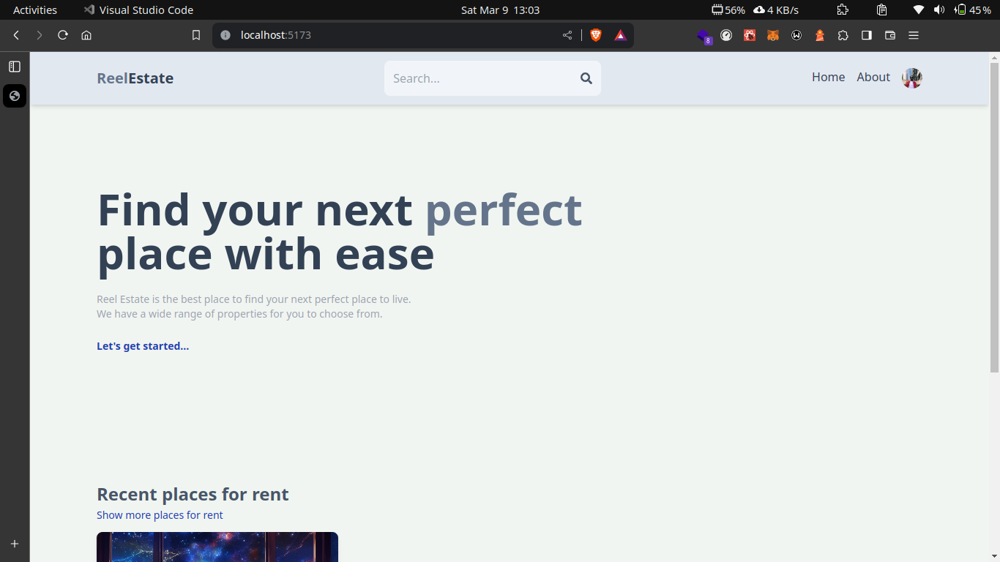
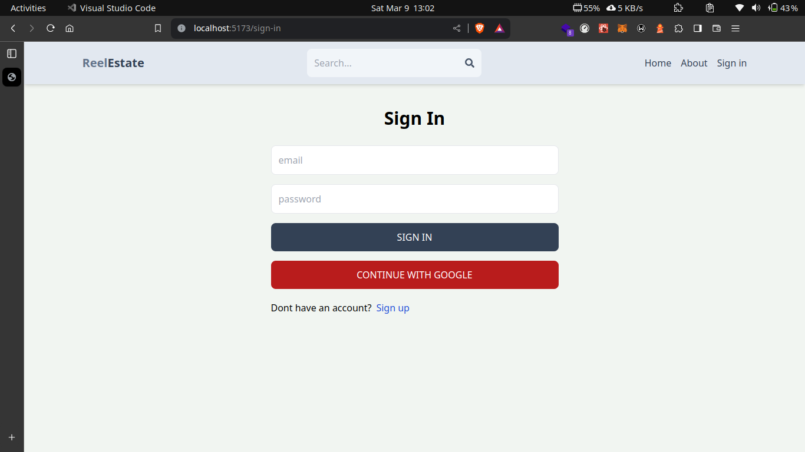
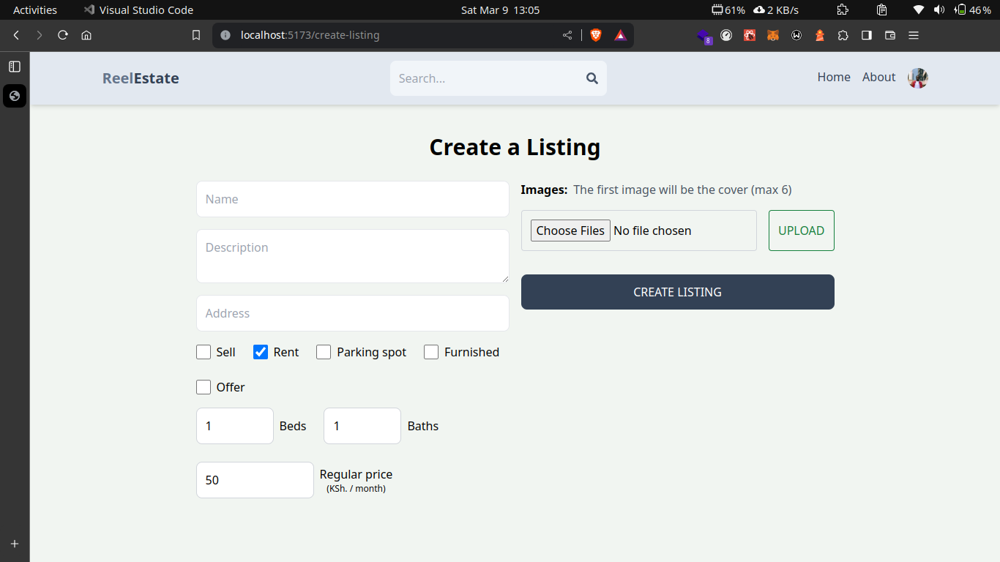
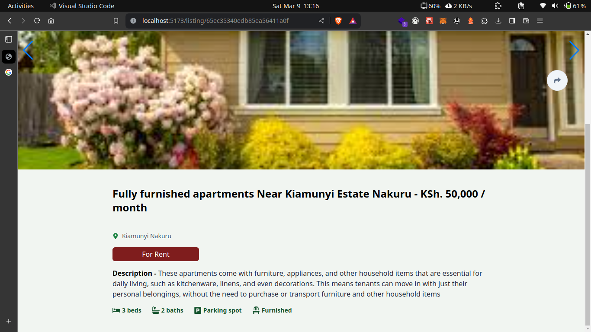

# ReelEstate: A Real Estate Listing Application

## Overview

This documentation provides an overview and guide for a simple real estate listing application. The application is built using React for the front-end, Redux for state management, Node.js with Express for the back-end, and MongoDB for the database. Firebase and Firestore are used for authentication.






### Functionality

The application allows users to:

1.  Create real estate listings.
2.  Edit and delete listings.
3.  Contact property owners regarding a listing.
4.  Edit user details such as username.

## Setup

### Prerequisites

- Node.js and npm installed on your machine.
- MongoDB instance set up.
- Firebase project created with Firestore enabled.

### Installation

1.  Clone the repository:

    ```bash
    git clone <repository-url>
    ```

2.  Navigate to the project directory:

    ```bash
    cd Real-estate-project
    ```

3.  Install dependencies for the server:

    ```bash
    cd api
    npm install
    ```

4.  Install dependencies for the client:

    ```bash
    cd ../client
    npm install
    ```

5.  Configure environment variables:

    - Create a `.env` file in the `api` directory.

    - Add the following environment variables:

      ```plaintext

      `PORT=3001
      MONGODB_URI=<your-mongodb-uri>
      FIREBASE_API_KEY=<your-firebase-api-key>
      FIREBASE_AUTH_DOMAIN=<your-firebase-auth-domain>
      FIREBASE_PROJECT_ID=<your-firebase-project-id>
      FIREBASE_STORAGE_BUCKET=<your-firebase-storage-bucket>
      FIREBASE_MESSAGING_SENDER_ID=<your-firebase-messaging-sender-id>
      FIREBASE_APP_ID=<your-firebase-app-id>`
      ```

6.  Start the server:

    ```bash
    npm run dev
    ```

7.  Start the client:

    ```bash
    `cd ../client
    npm start`
    ```

8.  Access the application in your browser at `http://localhost:5137`

## Usage

### Authentication

- Users can sign up and log in using Firebase authentication.
- Firebase authentication handles user authentication and token generation.

### Listings

1.  **Creating a Listing**:

    - Users can create real estate listings by providing details such as property type, location, price, etc.
    - The listing gets stored in the MongoDB database.

2.  **Editing a Listing**:

    - Users can edit their existing listings, updating details such as price, description, etc.

3.  **Deleting a Listing**:

    - Users can delete their listings if they no longer wish to have them displayed.

### Contacting Property Owner

- Users can contact the property owner regarding a listing.
- An email or message functionality can be integrated to facilitate communication.

### User Profile

- Users can edit their profile details, such as username.

## Technologies Used

- React
- Redux
- Node.js
- Express
- MongoDB
- Firebase Authentication
- Firestore

## Contributors

- [**Marsh VIncent**](https://github.com/marshvin)
- [**Aloys Aboge Jr**](https://github.com/AbogeJr)
- [**Michelle Thuo**](https://github.com/MichelleThuo)
- [**David Kihia**](https://github.com/DavidKihia)
